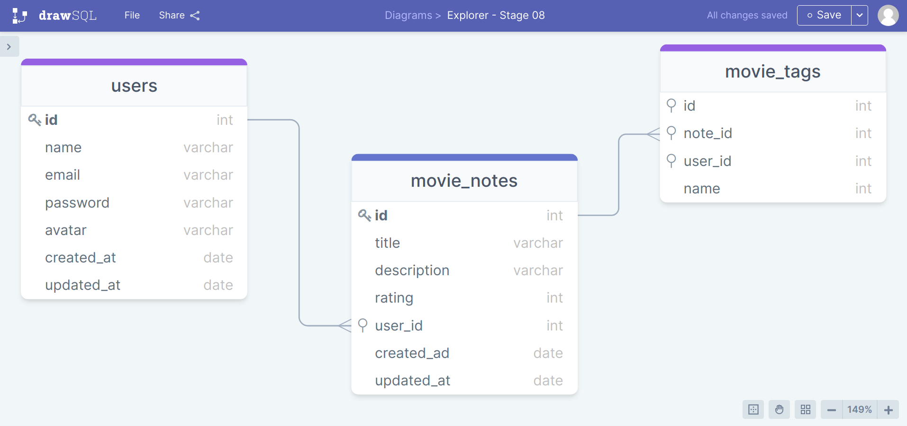
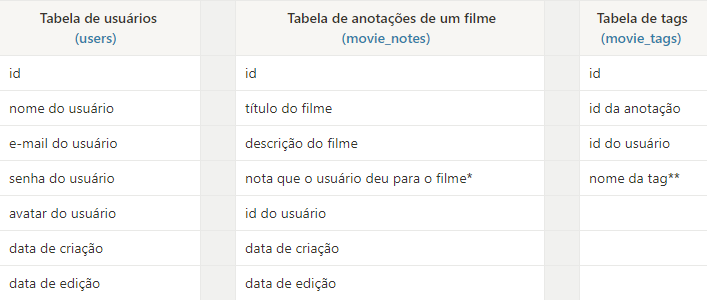

<h1 align="center"> RocketMovies </h1>

> Desafio do Stage 08 - Backend do Explorer da Rocketseat

  <a href="#-tecnologias">Projeto</a>&nbsp;&nbsp;&nbsp;|&nbsp;&nbsp;&nbsp;
  <a href="#-projeto">Estrutura</a>&nbsp;&nbsp;&nbsp;|&nbsp;&nbsp;&nbsp;
  <a href="#-projeto">Detalhamento</a>&nbsp;&nbsp;&nbsp;|&nbsp;&nbsp;&nbsp;
  <a href="#-layout">Tecnologias</a>&nbsp;&nbsp;&nbsp;|&nbsp;&nbsp;&nbsp;
  <a href="#-layout">Extras</a>&nbsp;&nbsp;&nbsp;|&nbsp;&nbsp;&nbsp;
  <a href="#memo-licença">Licença</a>

  

## :file_folder: Projeto

Aplicação em Node.js onde o usuário cadastra um filme, preenche com algumas informações (nome, descrição, nota) e cria tags relacionadas a ele.

## :pushpin: Estrutura

Abaixo, temos o diagrama utilizado como base para a criação do banco de dados:

## :clipboard: Detalhamento

Explicando cada tabela e seus campos:

  

**Valores inteiros que podem variar de 1 até o 5.*  
***Exemplos: ação, comedia, terror, medo...etc.*

## :computer: Tecnologias

Esse projeto foi desenvolvido com as seguintes tecnologias:

- Node.js;
- Express;
- SQLite;
- Knex.js.

## :bookmark: Extras

Alguns detalhes adicionados ao desafio:

- Criptografia de senhas;
- Validação de e-mail;
- Aplicação do cascade para garantir que uma tag seja excluída caso o usuário opte por excluir a nota.

## :memo: Licença

Esse projeto está sob a licença MIT.

---

Feito com :heart: by Madalena :wave: [Me acompanhe nas redes sociais!](https://madalena-rocha.github.io/social-links/)